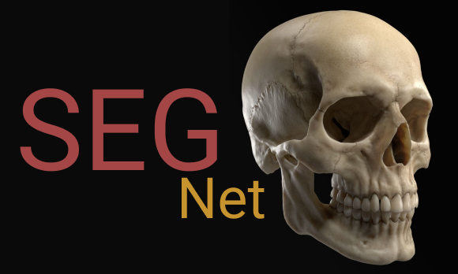

# SEGNet
### Automated Bone Segmenting and Rendering Application

# Introduction
SEGNet is an open-source, multi-platform bone segmentation and dicom view viewer with user friendly user interface. SEGNet provides ease in viewing Dicom data; Mouse integrations will help you to visualize dicom in a detailed way. SEGNet utilizes combined power of image processing and neural nets for fast segentation of bone from a CT Dicom data.

# Developments

- AI model needs to be implemented
- Fullscreen mode for widgets
- Advanced surface properties

# Requirements
- Pyqt5
- Opencv
- Numpy
- VTK

Requirements can be dwonloaded as shown below:
    
    git clone https://github.com/saivishwak/SEGNet.git 
    
    cd SEGNet
    
    pip3 install -r requirement.txt (For Linux add sudo)

# Running GUI

    cd SEGNet

    cd src

    python3 Main.py

Tested on Windows and Linux

## User Interface

    mouse_scroll on dicom widget - Change slice
    
    clrt + left_mouse_button - Pan

    clrt + mouse_scroll - Zoom

    mouse_right_button + drag - Contrast/Brightness

    r - Reset view

## [MIT License](https://raw.githubusercontent.com/saivishwak/SEGNet/master/LICENSE)

<h4>You can use it absolutely anywhere!</h4>

More information regarding AI model will be updated soon!

Feel free to make a pull request if you feel that you have improve this tool
